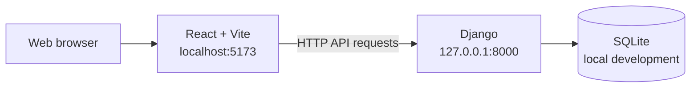

# Architecture

## Overview

bam-_boo_! is a full-stack web application with two independently run development services:

- A React frontend built and served by Vite.
- A Django backend that exposes HTTP endpoints and provides the Django admin site.

The frontend and backend are intentionally separated so that each can be developed, tested, and built with its own toolchain.

## System boundary



During local development, Vite serves the frontend and Django runs the backend separately. Django allows requests from the Vite development origin through `CORS_ALLOWED_ORIGINS`.

## Repository structure

```text
.github/
	CODEOWNERS       Ownership rules for frontend, backend, docs, and repository configuration

backend/
	counter/
		models.py       Persisted shared bam/boo count
		views.py        JSON read and update endpoints
		migrations/     Database schema migrations
	config/
		settings.py     Django settings, middleware, CORS, and database configuration
		urls.py         Root, health, and admin routes
		asgi.py         ASGI entry point
		wsgi.py         WSGI entry point
	manage.py         Django command-line entry point
	requirements.txt  Python dependencies
	pyproject.toml    Black formatter configuration
	db.sqlite3        Local database created by migrations (not committed)

frontend/
	src/
		main.tsx        React application entry point
		App.tsx         Current root React component
	    index.css       Tailwind CSS import and global styles
		assets/         Frontend image and SVG assets
	package.json      npm scripts and dependencies
	prettier.config.ts Prettier and Tailwind class-sorting configuration
	.prettierignore   Prettier exclusions
	tsconfig*.json    TypeScript configuration for app and build tooling
	vite.config.ts    Vite and Tailwind configuration

docs/
	ARCHITECTURE.md   Current system design and ownership boundaries
	SETUP.md          Local installation and run instructions
	CONTRIBUTING.md   Contribution and commit guidance
```

## Frontend

The frontend is written in TypeScript. Its entry point is `frontend/src/main.tsx`; it mounts the root `App` component into the page and loads `frontend/src/index.css`. The interface is styled with Tailwind CSS utility classes in React components; `frontend/src/index.css` imports Tailwind and contains only global CSS rules.

Use npm scripts from the `frontend` directory:

- `npm run dev`: start the Vite development server on port `5173`.
- `npm run build`: type-check the frontend and create a production build in `frontend/dist`.
- `npm run lint`: run the configured frontend linter.
- `npm run preview`: preview the production build locally.

Tailwind CSS is integrated through `@tailwindcss/vite` in `frontend/vite.config.ts`. Add UI styling with Tailwind utility classes rather than introducing component-specific CSS files unless a custom CSS rule is necessary.

Python formatting is enforced with Black using `backend/pyproject.toml`. Frontend formatting is enforced with Prettier and `prettier-plugin-tailwindcss`; Oxlint remains available as `npm run lint:js` for TypeScript and JavaScript quality checks.

## Backend

The Django project is configured in `backend/config`:

- `settings.py` enables Django’s built-in apps, `django-cors-headers`, and SQLite.
- `counter/` owns the shared count model and its JSON API.
- `urls.py` currently defines the following routes:
  - `/`: backend service status JSON.
  - `/api/health/`: health status JSON.
  - `/api/count/`: `GET` the saved count or `POST` a `delta` of `1` or `-1`.
  - `/admin/`: Django admin.
- `manage.py` is the entry point for checks, migrations, and the development server.

Backend dependencies are pinned in `backend/requirements.txt`. Run Django commands through the repository virtual environment.

## Data and persistence

Local development uses SQLite at `backend/db.sqlite3`. Django migrations are the source of truth for schema changes. Do not edit the database file directly or commit it to the repository.

When models are introduced or changed:

1. Add or update the Django model.
2. Generate a migration with `manage.py makemigrations`.
3. Apply migrations with `manage.py migrate`.
4. Include the migration files in the change.

## Request flow

1. A user opens the Vite-served React application in a browser.
2. React renders the current application route.
3. Frontend features call Django HTTP endpoints under the backend origin.
4. Django URL routing dispatches requests to views or installed Django applications.
5. Backend code reads or writes SQLite through Django’s ORM when persistence is required.
6. Django returns JSON or an appropriate HTTP response to the frontend.

## Architectural conventions

- Keep UI rendering and browser interaction in `frontend/`.
- Keep API routing, validation, business logic, persistence, and administration in `backend/`.
- Prefer explicit API boundaries over sharing implementation details between frontend and backend.
- Add frontend dependencies to `frontend/package.json` and backend dependencies to `backend/requirements.txt`.
- Keep local-only files such as virtual environments, SQLite databases, `node_modules`, and build output out of version control.

## Keeping this document current

Update this document in the same change whenever a structural decision changes. In particular, update it when:

- A new Django app, API boundary, database model, or persistence technology is added.
- Frontend routing, state management, API client structure, or build behavior changes.
- A service, port, environment variable, or external dependency is added.
- A directory moves or a new top-level project area is introduced.

Architecture changes should be called out in pull requests and reflected in the relevant setup or contribution documentation.
